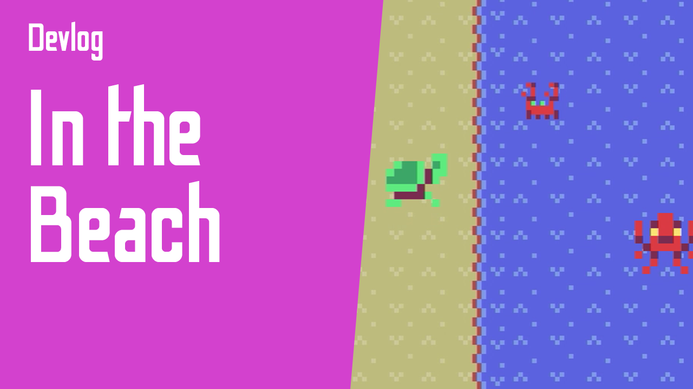

# In the Beach

Simple game made with [Ruby in Fantasy](https://github.com/fguillen/fantasy).

## Instructions

You are the turtle. Use the space bar to jump over the crabs an eat them... be careful with mom crab!

## How to run

    bundle install
    bundle exec ruby game.rb

## Credits

- Programming: Fernando Guillen
- Sprites: https://www.kenney.nl
- Sounds: https://www.oryxdesignlab.com/
