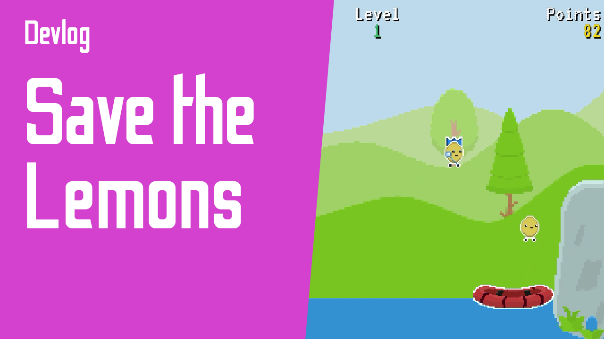

[Gameplay &#9654;](https://youtu.be/kTOkfHzyEQQ)

# Save the Lemons

Simple game made with [Ruby in Fantasy](https://github.com/fguillen/fantasy).

The lemons are trying to cross the river. Help them to not fall into the cold water. You manage the little lifeboat, be sure that as many as possible lemons finish the journey.

Strongly inspired in [Lemons by C. R. Dewhurst](http://bbcmicro.co.uk//jsbeeb/play.php?autoboot&disc=http://bbcmicro.co.uk//gameimg/discs/1825/Disc102-Lemons.ssd&noseek)

## Instructions

Use cursor keys left and right to manage the lifeboat. You get points when a lemon bounce
on your lifeboat. And extra points if the lemon riches the other side safely.

If 20 lemons sink into the cold water you lose the game.

Have special attention to the fairy lemons. If they reach the other side, they will reward you.

But watch out!. Some lemons are very angry; if they touch the lifeboat they will bite it!.

Press space bar to move the lifeboat faster.

## How to run

    bundle install
    bundle exec ruby game.rb

## Credits

- Programming: Fernando Guillen

## Assets

- Lemons: https://caz-creates-games.itch.io/cute-fruit-characters
- Textures: https://screamingbrainstudios.itch.io/tiny-texture-pack-2
- Other: https://kenney.nl/
- Music: Evan King - Weekly Loops Season 2 - 02 36 - Rest. https://www.youtube.com/channel/UCT1ZkP03V18LmOj8zbyP-Dw? - https://contextsensitive.bandcamp.com/
- Sounds: https://www.oryxdesignlab.com/
