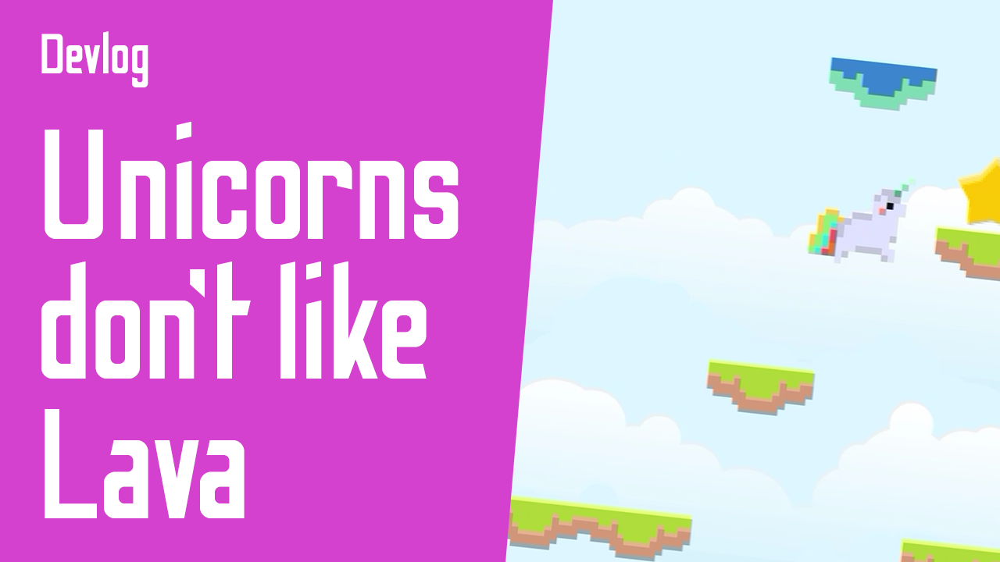

[Gameplay &#9654;](https://youtu.be/9XCyBVJ2bSE)

# Unicorns Don't Like Lava

Simple game made with [Ruby in Fantasy](https://github.com/fguillen/fantasy).

You are an unicorn, lava is growing under your feet, but you can scape if you reach the sky and your home at the rainbow. Try to save as many stars you can on your way.

## Instructions

Press space to jump and left and right cursors to control the movement to land in upper platforms until reach the rainbow in the top... before the lava reach you!

## How to run

    bundle install
    bundle exec ruby game.rb

## Credits

- Programming: Fernando Guillen

## Assets

- Sprites: https://www.kenney.nl
- Sounds: https://www.oryxdesignlab.com/
- Unicorn: https://rcxno.itch.io/pixel-art-unicorn
- Rainbow: [Background Vectors by Vecteezy](https://www.vecteezy.com/free-vector/background)
- Music: Evan King - Weekly Loops Season 2 - Rest. https://www.youtube.com/channel/UCT1ZkP03V18LmOj8zbyP-Dw? - https://contextsensitive.bandcamp.com/
